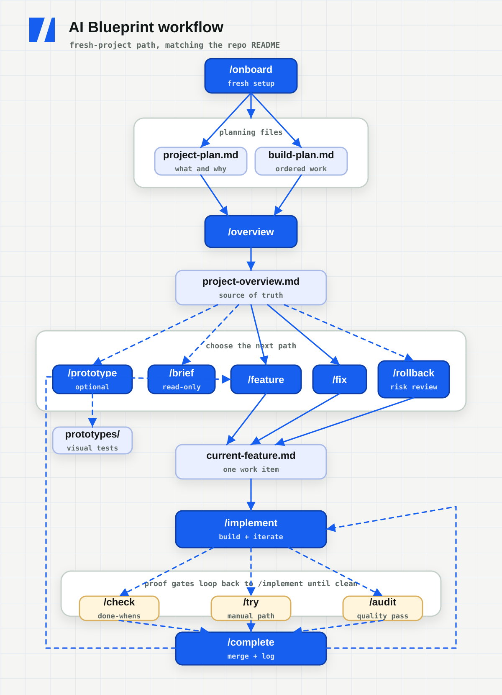

<p align="center">
  <picture>
    <source media="(prefers-color-scheme: dark)" srcset="assets/mark-dark.svg">
    <source media="(prefers-color-scheme: light)" srcset="assets/mark-light.svg">
    
  </picture>
</p>

<h1 align="center">AI BuildFlow</h1>

<p align="center"><strong>A file-backed, spec-driven workflow for building real software with AI while staying in control.</strong></p>

<p align="center">
  <a href="https://www.npmjs.com/package/create-ai-buildflow"></a>
  <a href="https://github.com/Nierowheezy/ai-buildflow/actions/workflows/validate.yml"></a>
  <a href="LICENSE"></a>
</p>

<p align="center">
  <a href="https://ai-buildflow-dev.vercel.app">Official site</a> |
  <a href="https://ai-buildflow-dev.vercel.app/docs/">Documentation</a> |
  <a href="https://www.youtube.com/watch?v=L4g6GGLzAyo">Video demo</a> |
  <a href="https://www.npmjs.com/package/create-ai-buildflow">npm</a> |
  <a href="https://github.com/Nierowheezy/ai-buildflow/releases">Releases</a> |
  <a href="CHANGELOG.md">Changelog</a>
</p>

AI BuildFlow gives coding agents a shared process for planning, building,
verifying, and documenting one feature at a time. Plans, specs, findings,
review evidence, and completed history stay as readable files in your project
instead of disappearing with the chat that created them.

It works with any application stack and supports Codex, Claude Code, GitHub
Copilot, OpenCode, and other file-aware coding agents.

Start with the scaffold-first [Quick Start](#quick-start) below.

## Why use it?

AI coding gets unreliable when product intent lives only in chat, several
features blur together, and claims such as "working" or "tested" are not backed
by observable evidence.

BuildFlow adds a controlled loop:

- **Spec before code.** The agent writes a feature or fix spec and stops for
  review before implementation.
- **One work item at a time.** The current feature, fix, or rollback has one
  explicit scope and one set of acceptance criteria.
- **Proof before completion.** Check runs the real app against the spec instead
  of treating a green build as behavioral proof.
- **Findings with teeth.** Audit records durable findings, and unresolved P0 or
  P1 findings block completion.
- **Independent review when it matters.** A fresh reviewer session can inspect
  an exact checkpoint and leave a staleness-checked receipt.
- **Human approval at external boundaries.** Commit, merge, push, deployment,
  publication, and destructive actions keep their approval gates.

The point is not to remove judgment. It is to preserve it while AI helps write
the code.

## Quick start

AI BuildFlow is a workflow overlay, not an application starter. Scaffold the
app first and initialize Git before installing it.

**Requirements:** Node.js 22 or newer, an existing application, and a Git
repository.

First create the application manually or with the scaffolding CLI for your
framework or language of choice. This example uses Next.js, but BuildFlow works
with any stack. From the root of the new application, initialize Git if the
scaffolder did not, then install BuildFlow:

```bash
npx create-next-app@latest my-app
cd my-app
git init
npx create-ai-buildflow@latest
```

Next:

1. Run `onboard` so BuildFlow learns the real stack, commands, conventions,
   adapter setup, and workflow visibility you want.
2. Write `buildflow/project-plan.md` and `buildflow/build-plan.md` directly, or
   use the optional discovery skill to develop them through conversation.
3. Run `overview` to turn those plans into durable project context. On the first
   run, it offers a reviewed local commit for the BuildFlow setup and plans.
4. Run `feature` for the next planned item, review the generated spec, and then
   begin implementation.

Use the invocation style for your tool:

| Tool | Example |
| --- | --- |
| Codex | `$onboard`, `$overview`, `$feature` |
| Claude Code | `/onboard`, `/overview`, `/feature` |
| GitHub Copilot | Ask Copilot to run the matching skill |
| OpenCode | Ask OpenCode to run the matching skill |

The interactive installer lets you select one or more adapters. It adds the
workflow files needed by those tools and leaves your application's `README.md`
alone.

See [Getting Started](https://ai-buildflow-dev.vercel.app/docs/getting-started/) for the
complete installation and onboarding walkthrough. For a project that already
has shipped features, start with
[Adopting an Existing Codebase](https://ai-buildflow-dev.vercel.app/docs/existing-codebase/).

## The workflow

The normal feature loop is:

```text
feature -> review spec -> implement -> check -> audit current -> complete
```



Each step has a narrow job:

1. **Feature** selects one build-plan item and writes its buildable spec.
2. **Implement** builds the approved spec in small, visible steps.
3. **Check** proves the acceptance criteria against the running application.
4. **Audit** reviews the complete branch delta and records actionable findings.
5. **Complete** runs the final gates, archives the work, and asks before merge.

Other work enters the same control loop:

- Use `fix` for a small unplanned change or confirmed bug.
- Use `debug` first when the cause is unclear.
- Use `rollback` to reverse a completed feature without erasing its history.
- Use `try` when you want a human manual-review guide.

Read [Core Workflow](https://ai-buildflow-dev.vercel.app/docs/core-workflow/) for the full
lifecycle and command-specific behavior.

## Command map

| Skill | Purpose |
| --- | --- |
| **/adopt** | Bring BuildFlow into an existing codebase with shipped behavior. |
| **/audit** | Review a branch or project, record findings, or run independent review. |
| **/autopilot** | Run one bounded spec and build pass through configured gates. |
| **/brief** | Preview an upcoming feature without changing project state. |
| **/browser-tests** | Add or normalize an optional repeatable browser harness. |
| **/check** | Prove the current spec against the real application. |
| **/ci** | Align one project Verify command with GitHub checks. |
| **/complete** | Run final gates, archive the work, and request merge approval. |
| **/continuous** | Complete reviewed build-plan items serially with local Git work. |
| **/debug** | Reproduce and isolate a failure without editing code. |
| **/discovery** | Develop detailed plans through a reviewed conversation. |
| **/doctor** | Check BuildFlow setup and drift without changing files. |
| **/feature** | Turn one build-plan item into the active spec. |
| **/fix** | Write the active spec for a small change or confirmed bug. |
| **/implement** | Build the approved spec in small, reviewed steps. |
| **/onboard** | Tune a fresh BuildFlow installation to the real project. |
| **/overview** | Generate durable project context from both planning docs. |
| **/prototype** | Create throwaway static mockups before implementation. |
| **/release** | Prepare local Render or Vercel release configuration and checks. |
| **/rollback** | Plan a history-preserving reversal of completed work. |
| **/status** | Show progress, drift, blockers, and the suggested next action. |
| **/tests** | Add or normalize stack-native unit testing. |
| **/try** | Generate a human manual-review walkthrough. |

Codex uses the matching `$skill` form. Other adapters use the invocation style
shown during installation. Each command has a dedicated page in the
[documentation](https://ai-buildflow-dev.vercel.app/docs/).

## File-backed project state

Two files remain the planning inputs you own:

| File | Purpose |
| --- | --- |
| `buildflow/project-plan.md` | Product direction, users, features, data, stack, business model, and UX decisions |
| `buildflow/build-plan.md` | Ordered, high-level feature list with stable item numbers |

BuildFlow turns those inputs into project state that any installed adapter can
read:

| File | Purpose |
| --- | --- |
| `buildflow/context/project-overview.md` | Durable project context generated from both plans |
| `buildflow/context/current-feature.md` | The active feature, fix, or rollback spec |
| `buildflow/context/findings.md` | Audit findings with durable IDs, severities, and statuses |
| `buildflow/context/review.md` | Independent-review handoff and latest reviewer receipt |
| `buildflow/history/` | Archived feature, fix, and rollback records |
| `buildflow/config.json` | User-owned workflow policy shared by every adapter |

This state stays tool-independent. A project can move between supported agents
without moving its plan and history back into chat.

Read [Writing Your Plans](https://ai-buildflow-dev.vercel.app/docs/writing-your-plans/) and
the [File Reference](https://ai-buildflow-dev.vercel.app/docs/file-reference/) for the
detailed contracts.

## Review and verification

BuildFlow separates several kinds of proof that are easy to blur together:

- **Verify command:** project-owned type checks, tests, builds, or other
  repeatable checks.
- **Check:** observable proof that the current work satisfies its spec.
- **Audit:** branch-aware review across quality, security, performance, and
  tests, with focused lenses when needed.
- **Independent Audit:** a fresh reviewer session inspects an approved
  checkpoint using the selected installed adapter and model.
- **Try guide:** a read-only manual walkthrough for human review.

Independent review records the target, permitted base, spec hash, requested and
actual reviewer metadata, Check result, commands, evidence, findings, and
remaining risk. Relevant later changes make the receipt stale. Adapter, model,
and fresh-session identity remain declared metadata, not cryptographic proof.

All quality gates default to manual. Projects can make them conditional or
required through `buildflow/config.json` without granting permission to merge,
push, deploy, publish, or waive findings.

Read [Code Quality](https://ai-buildflow-dev.vercel.app/docs/code-quality/),
[Audit](https://ai-buildflow-dev.vercel.app/docs/commands/audit/), and
[Project Configuration](https://ai-buildflow-dev.vercel.app/docs/project-configuration/)
for the complete rules.

## Context efficiency

BuildFlow keeps durable project context available without loading every workflow
rule into every Claude Code turn. New installations auto-import only the core
project instructions, compact overview, and active spec. Workflow skills load
coding standards and interaction rules when they are needed, and implementation
uses one feature-level review packet by default.

`/overview` keeps generated project context below 20,000 bytes, while `/doctor`
flags oversized legacy overviews. A controlled Opus 5 test measured 55% less
startup context and about 36% less Feature context after compacting the overview.

Existing projects keep their own `CLAUDE.md` and configuration during updates.
Run `/doctor` afterward, then follow the [updating guide](https://ai-buildflow-dev.vercel.app/docs/updating-buildflow/)
for any recommended cleanup. Read the [benchmark](benchmarks/context-efficiency.md)
for the full method, charts, results, and limits.

## Automatic GitHub checks

Automatic checks are an explicit setup step, not part of installation or
onboarding. Run `ci` when you want BuildFlow to define one project-specific
Verify command from checks the repository already has and create or align a
matching GitHub workflow.

**Verify is the recipe.** CI runs that same recipe automatically on pull
requests and default-branch pushes. BuildFlow does not invent a test runner,
coverage target, browser suite, security scan, or version matrix just to fill
the workflow.

Read [CI Setup](https://ai-buildflow-dev.vercel.app/docs/commands/ci/) for the full contract.

## Optional automation

The conservative workflow remains the default. Two explicit modes can automate
bounded local work while preserving the same gates:

- **Autopilot** runs one feature or fix through its configured regular gates,
  then stops before completion.
- **Continuous Mode** processes reviewed build-plan items serially with one
  local branch and one local main commit per completed feature.

Neither mode pushes, deploys, publishes, sends messages, performs destructive
actions, waives findings, or makes uncovered product decisions.

Read [Autopilot](https://ai-buildflow-dev.vercel.app/docs/commands/autopilot/) and
[Continuous Mode](https://ai-buildflow-dev.vercel.app/docs/commands/continuous/) before
using them.

## Tool support

| Tool | Installed adapter | Invocation |
| --- | --- | --- |
| Codex | `.agents/skills/` | `$feature`, `$implement`, or plain language |
| Claude Code | `.claude/skills/` | `/feature`, `/implement`, and other slash commands |
| GitHub Copilot | `AGENTS.md` and `.agents/skills/` | Ask Copilot to run the matching skill |
| OpenCode | `AGENTS.md` and compatible shared skills | Ask OpenCode to run the matching skill |
| Other tools | `AGENTS.md` plus readable skill files | Ask the agent to follow the matching `SKILL.md` |

Codex, GitHub Copilot, and OpenCode can share `.agents/skills/`. Claude Code
uses `.claude/skills/`, which OpenCode can also reuse. The installer avoids
duplicating the same skills under `.opencode/skills/`.

Read [Tool Adapters](https://ai-buildflow-dev.vercel.app/docs/tool-adapters/) for selection,
invocation, and project-layout details.

## Optional capabilities

Use only what the project needs:

- `discovery` develops detailed plans through a reviewed conversation.
- `doctor` checks BuildFlow health without changing files.
- `status` reports progress, drift, blockers, and the suggested next action.
- `tests` adds or normalizes stack-native unit testing.
- `browser-tests` adds an explicit repeatable browser harness.
- `ci` aligns one project Verify command with GitHub checks.
- `prototype` creates throwaway static mockups before the build loop.
- `release` prepares local Render or Vercel configuration and readiness checks.

The [documentation](https://ai-buildflow-dev.vercel.app/docs/) has one page for every
command, plus guides for testing, configuration, manual review, updating, and
troubleshooting.

## Status, dashboard, and updates

Check a BuildFlow project without changing it:

```bash
npx create-ai-buildflow@latest status
```

Preview and apply managed workflow updates:

```bash
npx create-ai-buildflow@latest update --dry-run
npx create-ai-buildflow@latest update
```

An optional global installation exposes the shorter read-only status and local
dashboard commands:

```bash
npm install --global create-ai-buildflow@latest
buildflow status
buildflow dashboard
```

The dashboard binds to `127.0.0.1`, reads the same project files and Git state,
and stops when you press Ctrl+C. It does not run workflow commands or expose the
project outside the local machine.

Read [Updating BuildFlow](https://ai-buildflow-dev.vercel.app/docs/updating-buildflow/),
[CLI Status](https://ai-buildflow-dev.vercel.app/docs/cli/status/), and
[Local Dashboard](https://ai-buildflow-dev.vercel.app/docs/cli/dashboard/) for details.

## Documentation

- [Getting Started](https://ai-buildflow-dev.vercel.app/docs/getting-started/)
- [Core Workflow](https://ai-buildflow-dev.vercel.app/docs/core-workflow/)
- [Command Reference](https://ai-buildflow-dev.vercel.app/docs/)
- [Project Configuration](https://ai-buildflow-dev.vercel.app/docs/project-configuration/)
- [Testing](https://ai-buildflow-dev.vercel.app/docs/testing/)
- [Manual Review](https://ai-buildflow-dev.vercel.app/docs/manual-review/)
- [Local-Only Mode](https://ai-buildflow-dev.vercel.app/docs/local-only-mode/)
- [Troubleshooting](https://ai-buildflow-dev.vercel.app/docs/troubleshooting/)

## Support and contributing

- Follow [SUPPORT.md](SUPPORT.md) for usage questions and reproducible bugs.
- Follow [SECURITY.md](SECURITY.md) to report vulnerabilities privately.
- Read [CONTRIBUTING.md](CONTRIBUTING.md) before opening a pull request.
- Review [CHANGELOG.md](CHANGELOG.md) for published package history.

## License

AI BuildFlow is available under the [MIT License](LICENSE).
