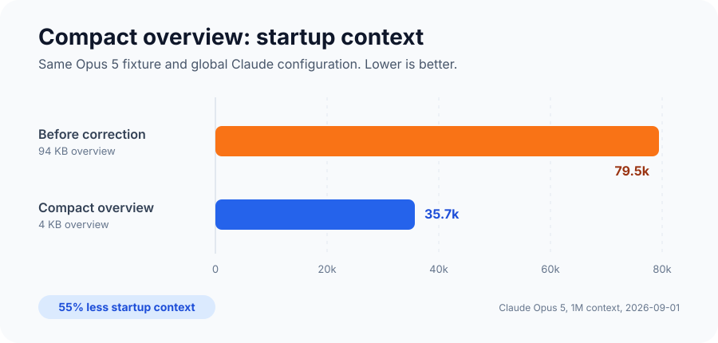
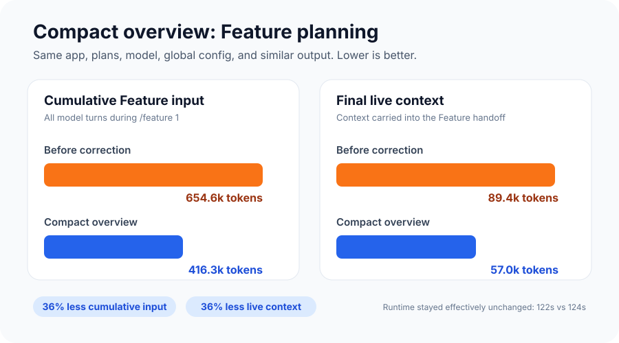

# Context Efficiency Benchmark

AI BuildFlow was retested on 2026-09-01 after a user reported a 33.8k-token
`project-overview.md` and a fresh `/feature` session reaching 162.9k tokens. The
test focused on the largest actionable cause: an overview that had become a
detailed plan copy instead of a compact consolidation.

## Results

| Measurement | Before correction | Compact overview | Savings |
| --- | ---: | ---: | ---: |
| Overview file size | 94,441 bytes | 4,087 bytes | 90,354 bytes (95.7%) |
| Fresh-session startup input | 79,479 | 35,688 | 43,791 (55.1%) |
| Feature cumulative input | 654,550 | 416,302 | 238,248 (36.4%) |
| Final Feature context | 89,352 | 57,034 | 32,318 (36.2%) |
| CLI estimated list cost | $0.9982 | $0.6940 | $0.3042 (30.5%) |
| Feature runtime | 122 seconds | 124 seconds | effectively unchanged |

The corrected Feature run produced almost the same amount of model output as
the original run: 8,624 output tokens versus 8,594. The runtime was also nearly
identical. This makes the context reduction more useful than the earlier
lazy-loading experiment, which mostly moved context between categories and
reduced cumulative Feature input by only 1%.

## What changed

- `/overview` must keep the generated `project-overview.md` below 20,000 bytes.
  It measures the file before handoff and compacts repeated narrative while
  preserving contracts, build order, and constraints.
- `/doctor` reports the overview byte size and flags files at or above 20,000
  bytes.
- `/feature` checks the size before continuing. It stops on an oversized
  overview and directs the user to `/overview`.
- Feature reuses the overview already loaded by Claude Code instead of reading
  the same file again with a tool.

Claude Code still starts with `AGENTS.md`, the compact overview, and the active
spec. This preserves normal project awareness and commands such as "continue"
while removing the large-file failure mode. Coding standards and interaction
rules still load only when relevant, and feature-level implementation review
remains the default.

## Method

- Claude Code 2.1.252
- `claude-opus-5`, high effort, 1,000,000-token context window
- Chrome disabled and an empty strict MCP configuration
- Same machine and global Claude configuration for both Feature runs
- Same minimal Node task-tracker app, plans, and Claude adapter
- No dev server or browser check
- Fresh sessions for startup and `/feature 1`
- Before fixture: 94,441-byte synthetic overview shaped around the same project,
  with the reporter's legacy eager imports
- Corrected fixture: `/overview` generated a 4,087-byte overview from the same
  project and build plans, with the current reduced import layout

Input totals are the CLI's reported `input_tokens`,
`cache_creation_input_tokens`, and `cache_read_input_tokens`. Final context is
the same sum from the last Feature model request. CLI estimated list cost is not
a prediction of Claude subscription quota use.

## Literal sandbox confirmation

The corrected workflow was also rerun end to end through the repository's actual
`npm run sandbox` command, using the package tarball packed from the working
branch. The Claude-only sandbox passed its app tests and build, then fresh Opus
sessions ran `/overview` and `/feature 1`.

- Overview generated a 3,524-byte project overview.
- Feature checked the size with `wc -c` and did not read the already loaded
  overview with a tool.
- Cumulative Feature input was 424,261 tokens and final context was 58,384.
- Feature produced 8,933 output tokens in 128 seconds.

The cumulative and final-context totals were within 2.4% of the corrected
fixture shown in the charts. This second run confirms that the measured result
holds through the public sandbox path, not only in the isolated benchmark
directory.

## Limits

This is one controlled fixture, not a universal savings guarantee. The
reporter's 162.9k post-Feature context was not reproduced, so the benchmark does
not claim every project will fall to 57k. Tool output, global skills, plugins,
model behavior, project size, and the work itself all affect usage.

The before fixture intentionally matched the oversized overview and legacy
imports that triggered the report. The corrected fixture includes both the
compact-overview fix and the reduced Claude imports already introduced in 1.4.
The result therefore represents the practical upgrade path for that report, not
an isolated measurement of only one line of instructions.
